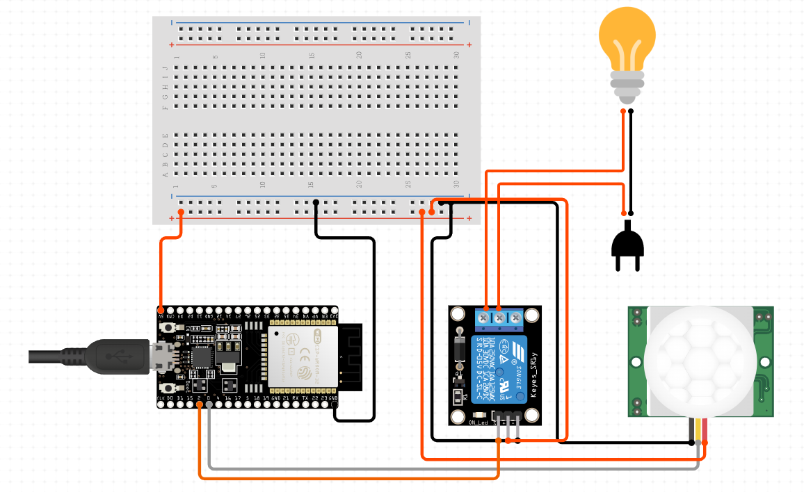

# SCI Smart Switch

An IoT-based smart lighting system developed for the **SCI – Intelligent and Communicating Systems** module.

This project combines a React Native mobile application with an ESP8266-based embedded system to provide smart home lighting automation using MQTT communication.

## Features

- Remote lamp control using a mobile application
- Motion detection using a PIR sensor
- MQTT-based communication
- Automatic light activation based on movement
- Manual ON/OFF control
- WiFi configuration using WiFiManager
- Real-time communication between mobile app and ESP8266

# Project Overview

The system is composed of two main parts:

## 1. Mobile Application

- Built using React Native and Expo
- Provides remote control for the smart switch
- Connects to the MQTT broker

## 2. Embedded System

- Built using ESP8266 / NodeMCU
- Controls the relay and lamp
- Reads motion sensor data
- Communicates with the mobile app through MQTT

# Technologies Used

## Mobile Application

- React Native
- Expo
- MQTT
- React Native Paper
- AsyncStorage

## Embedded System

- ESP8266 / NodeMCU
- Arduino IDE
- WiFiManager
- PubSubClient
- EEPROM

# Hardware Components

- ESP8266 / NodeMCU
- PIR Motion Sensor
- Relay Module
- Light Bulb
- Breadboard
- Jumper Wires
- 220V AC to 5V DC Adapter

# MQTT Communication

The application and ESP8266 communicate using MQTT topics.

| Topic                        | Description                  |
| ---------------------------- | ---------------------------- |
| `smart-switch/status`        | Controls lamp state          |
| `smart-switch/motion-status` | Sends motion detection state |
| `smart-switch/voice-control` | Handles voice control mode   |

# Installation

## Mobile Application

Clone the repository:

```bash
git clone https://github.com/Meriem-ht/SCI.git
```

Install dependencies:

```bash
npm install
```

Start the project:

```bash
npx expo start
```

# ESP8266 Setup

1. Install Arduino IDE
2. Install ESP8266 board package
3. Install required libraries:

- ESP8266WiFi
- WiFiManager
- PubSubClient
- EEPROM

4. Upload the firmware located in:

```text
hardware/esp8266/
```

# Circuit Diagram




# Team Members

- Serine Sefardjelah
- Hadjer Laissaoui
- Meriem Hathat
- Habiba Moulfi

# Academic Context

This project was developed as part of the **SCI – Intelligent and Communicating Systems** module at ESI.

# License

This project is intended for academic and educational purposes.
